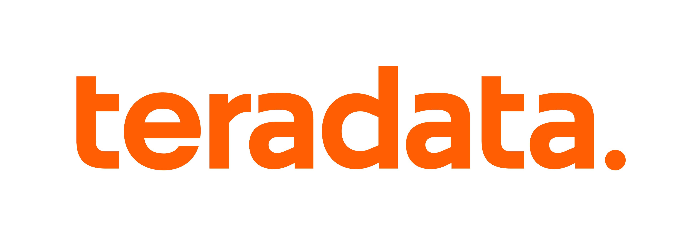

# Teradata Brand Guidelines Skill

## Overview
This skill provides comprehensive Teradata brand guidelines for creating, editing, and reviewing brand-compliant documents. Use it whenever you need to create PowerPoint presentations, proposals, marketing materials, web pages, demos, or any other Teradata-branded content to ensure proper visual identity, messaging, and style.

## Critical Requirements (Non-Negotiable)

These rules have ZERO flexibility. Violating them produces off-brand, unprofessional output.

### Logo: ALWAYS Use Provided Asset Files
**NEVER recreate, redraw, or programmatically generate the Teradata logo.** The logo's proportions, spacing, and distinctive dot placement are precisely designed and cannot be accurately reproduced.

✓ **ALWAYS DO**: Embed/reference the provided PNG files:
- `assets/teradata_sym_rgb_pos.png` - Symbol logo (favicons, small spaces, brand icon as part of a larger design)
- `assets/teradata_logo_rgb_pos.png` - Full wordmark (primary use)

✗ **NEVER DO**:
- Create SVG text elements spelling "teradata" with a circle for the dot
- Use any font to type "teradata." and call it the logo
- Programmatically draw or generate the logo
- Recreate the logo in CSS, Canvas, or any other method

**Why this matters**: The "teradata." mark has precise kerning, weight, and dot positioning that cannot be replicated by typing or drawing. Even small deviations (like incorrect dot spacing) immediately signal "unofficial" or "amateur."

**Implementation examples**:

HTML/Web:
```html

```

React/JSX:
```jsx

```

For white logo on dark backgrounds, apply CSS filter or use a white version if available:
```css
.logo-white { filter: brightness(0) invert(1); }
```

**Base64 Embedding (use only when necessary)**:
For environments that require embedded images (e.g., single-file React artifacts, email templates, data URIs), an optimized base64-encoded version of the symbol logo is available in `assets/logo-base64-reference.md`. **The default choice should always be to use the PNG files directly** - only use base64 when the environment doesn't support external file references.

### Colors: Use Exact Hex Values
- **Teradata Orange**: `#FF5F02` only (not #FF6600, not "orange")
- **Navy**: `#00233C` only
- **White**: `#FFFFFF`

### Typography: Inter Font Family Only
No substitutions. If Inter is unavailable, note the deviation explicitly.

---

## When to Use This Skill
Invoke this skill whenever you need to:
- Create branded Teradata documents (presentations, proposals, brochures, web pages)
- Review existing materials for brand compliance
- Apply Teradata visual identity (colors, logos, typography)
- Write copy that aligns with Teradata's voice and messaging
- Ensure proper use of terminology and style conventions
- Edit or update Teradata marketing materials

## Core Brand Elements

### Brand Personality
Teradata's brand personality is expressed through four key traits:
- **Courageous**: Bold, decisive, unafraid to challenge conventions
- **Confident**: Self-assured, expert, authoritative without arrogance
- **Dynamic**: Energetic, forward-thinking, innovative
- **Compassionate**: Empathetic, human-centered, collaborative

### Brand Messaging Framework
**North Star Message**: "Be business confident"

**Three Pillars**:
1. **Be ready**: Prepare for anything with trusted, reliable data
2. **Make breakthrough decisions**: Transform data into actionable insights
3. **Drive positive impact**: Create meaningful business outcomes

### Voice Principles
Apply these principles to all written content:
1. **Speak with certainty**: Be confident and decisive, avoid hedging language ("we believe" → "we deliver")
2. **Speak mindfully**: Be clear and purposeful, respect the audience's time, eliminate fluff
3. **Speak actively**: Use active voice and strong verbs ("Teradata enables" not "is enabled by")

### Visual Identity

#### Primary Colors
- **Teradata Orange**: `#FF5F02` (RGB: 255, 95, 2)
  - Primary brand color, used for emphasis, key elements, and CTAs
  - Most recognizable brand element
- **Navy**: `#00233C` (RGB: 0, 35, 60)
  - Supporting color for text, structure, and grounding
- **White**: `#FFFFFF`
  - Essential for balance, breathing room, and clarity

#### Secondary Colors (Use Sparingly for Accent)
- **Lavender**: `#D8BFD8`
- **Blue**: `#4A90E2`
- **Green**: `#7ED321`

**Color Usage Rules**:
- Orange is primary - use for the most important elements
- Navy provides structure and professionalism
- White space is critical - don't fill every inch
- Secondary colors are accents only, not primary design elements
- Maintain high contrast for accessibility (WCAG AA minimum)

#### Typography
**Primary Font**: Inter (required for all brand materials)
- **Headlines**: Inter Light (300 weight) - clean, modern, approachable
- **Subheads**: Inter SemiBold (600 weight) - strong hierarchy
- **Body Text**: Inter Regular (400 weight) - optimal readability
- **Emphasis**: Inter Medium (500 weight) or Bold (700 weight) - sparingly

**Font Hierarchy Best Practices**:
- Maintain clear size differentiation (e.g., 36pt headline, 18pt subhead, 11pt body)
- Use consistent line spacing (1.5x for body text recommended)
- Ensure sufficient contrast for readability (navy or black on white)
- Don't mix Inter with other fonts - consistency is key

**If Inter is unavailable**: Use system defaults but note the deviation

#### Logo Usage
**Primary Logomark**: "teradata." with distinctive dot

⚠️ **MANDATORY**: Always use the provided logo asset files. See "Critical Requirements" section above.

**Logo Files** (use these, do not recreate):
- `assets/teradata_logo_rgb_pos.png` - Full wordmark for general use
- `assets/teradata_sym_rgb_pos.png` - Symbol/icon version for small spaces and favicons

**Placement Rules**:
- **Clear space**: Minimum of lowercase "t" height on all sides
- **Orange logo**: Use on white/light backgrounds
- **White logo**: Use on dark backgrounds or photography (apply CSS filter if needed)
- **Lock-ups**: Maintain proper proportions and spacing

**Never**:
- Alter, stretch, rotate, outline, add effects, or modify colors
- Place on busy backgrounds without sufficient contrast
- Recreate or redraw the logo in any form

### Photography Guidelines
- **Style**: Contemporary, authentic, human-centered, purposeful
- **Subject Matter**: Real people in real work environments, diverse representation
- **Treatment**: Natural lighting, candid moments, clear composition
- **Avoid**: Overly staged scenes, stock photo clichés, outdated imagery, non-diverse subjects

### Layout Principles
- **Grid System**: Use consistent column grids for structure and alignment
- **White Space**: Embrace generous negative space for clarity and focus
- **Hierarchy**: Establish clear visual hierarchy through size, color, weight, and placement
- **Alignment**: Maintain consistent alignment throughout (left-align for readability)
- **Balance**: Distribute visual weight evenly across compositions

## Style and Terminology

### General Style Rules
- **Capitalization**: Sentence case for headlines (not title case)
  - ✓ "Transform your data into insights"
  - ✗ "Transform Your Data Into Insights"
- **Numbers**: Spell out one through nine, use numerals for 10 and above
- **Acronyms**: Define on first use, then use acronym consistently
  - "artificial intelligence and machine learning (AI/ML)"
- **Lists**: Use parallel structure, complete sentences end with periods
- **Dates**: Month DD, YYYY format (e.g., "February 3, 2026")
- **Time**: 12-hour format with am/pm (lowercase, no periods)

### Key Teradata Terms (Always Use Correctly)
- **Teradata VantageCloud** - Cloud-native data platform (not "Vantage Cloud")
- **Teradata Vantage** - On-premises or hybrid deployment
- **ClearScape Analytics** - Analytics suite (note the capital S)
- **AI/ML** - Use with hyphen and slash
- **data warehouse** - Two words, lowercase (unless part of product name)
- **cloud-native** - Hyphenated when used as adjective
- **multicloud** - One word, no hyphen

### Writing Style Best Practices
- **Active voice preferred**: "Teradata enables confident decisions" not "Confident decisions are enabled"
- **Clear and concise**: Eliminate unnecessary words and phrases
- **Avoid jargon**: When technical terms are necessary, provide context
- **Be specific**: Use concrete examples and data when possible
- **Customer-focused**: Lead with benefits, not features

## Document Creation Guidelines

### PowerPoint Presentations
**Template**: Use `assets/Teradata Branded PowerPoint Template - Internal.potx`

**Design Principles**:
- Orange accent color for key points and CTAs
- Navy for supporting text and structure
- Inter font throughout (no substitutions)
- One key message per slide (avoid clutter)
- Consistent footer with Teradata branding
- High-quality imagery aligned with photo guidelines
- Generous white space - don't overcrowd slides

**Content Principles**:
- Lead with the "so what" - business value first
- Use data and proof points to support claims
- Apply voice principles (certainty, mindfulness, active)
- End with clear call-to-action

### Word Documents
**Templates**:
- `assets/Teradata Word Template - Internal - MD002750_v5.0.DOCX` - General use
- `assets/Agenda Word Template - Internal - MD002748.DOCX` - Meeting agendas

**Formatting**:
- Navy for headings, black for body text
- Orange for emphasis elements only (sparingly)
- Consistent header/footer with branding
- Professional spacing (1.5x line spacing for body)
- Clear document hierarchy (H1 > H2 > H3)
- Margins: 1" all sides (or per template)

### Marketing Materials & Web Content
**Messaging Structure**:
1. Lead with benefit-driven headline
2. Support with proof points and data
3. Include customer success stories when relevant
4. End with clear, compelling call-to-action

**Design Elements**:
- Balance text with visual elements
- Use orange strategically for emphasis
- Maintain brand personality throughout
- Ensure mobile-friendly layouts (web)
- Follow accessibility guidelines (WCAG AA)

### Brand-Approved Icons

**Icon Library**: `assets/icons/` - 753 icons in PNG + SVG formats, organized into 58 categories.

Full documentation: `assets/icons/README.md`

#### Quick Usage

**HTML:**
```html

  <!-- SVG recommended -->
```

**React/JSX:**
```jsx

```

#### Key Categories

| Category | Icons | Best For |
|----------|-------|----------|
| `AI-ML` | 22 | AI/ML features, neural networks, automation |
| `Analytics-Database` | 14 | Data operations, database features |
| `Cloud` | 9 | Cloud services, infrastructure |
| `Data-Transfer` | 27 | Data movement, ETL, sync |
| `Graphs-Charts-Metrics` | 4 | Dashboards, KPIs, reporting |
| `Programming` | 20 | Development, code, APIs |
| `Server` | 5 | Infrastructure, deployment |
| `Locks-Security` | 11 | Security features, authentication |
| `People-Users` | 15 | User management, profiles |
| `Settings` | 10 | Configuration, preferences |

#### Icon Guidelines

- **Prefer SVG** for web (scales without quality loss, CSS-styleable)
- **Use PNG** for email templates, legacy systems
- **Sizing**: 16-20px inline, 24-32px buttons, 48-64px features
- **Colors**: Orange (#FF5F02) default, Navy (#00233C) or White for alternatives
- **Accessibility**: Always include meaningful `alt` text

#### Styling SVG Icons
```css
.icon { width: 24px; height: 24px; }
.icon-orange path { fill: #FF5F02; }
.icon-navy path { fill: #00233C; }
```

## Quick Compliance Checklist

Before finalizing any Teradata document, verify:
- [ ] **Logo**: Used provided PNG asset file (NOT recreated/redrawn)
- [ ] **Logo placement**: Proper clear space, correct color for background
- [ ] **Colors**: Exact hex values (Orange #FF5F02, Navy #00233C)
- [ ] **Typography**: Inter font family used throughout
- [ ] **Voice**: Principles applied (certainty, mindfulness, active voice)
- [ ] **Terminology**: Used correctly per style guide
- [ ] **Hierarchy**: Clear visual hierarchy established
- [ ] **White space**: Adequate breathing room, not cluttered
- [ ] **Photography**: Aligns with guidelines (if applicable)
- [ ] **Icons**: Using brand-approved icons from `assets/icons/` (if applicable)
- [ ] **Messaging**: Aligns with brand pillars and North Star
- [ ] **Personality**: Reflects courageous, confident, dynamic, compassionate traits

## Common Mistakes to Avoid

1. **Recreating the logo**: NEVER draw, type, or programmatically generate "teradata." - always use the provided PNG files. The dot spacing and letterforms cannot be accurately reproduced.
2. **Wrong orange shade**: Using #FF6600 or other oranges instead of #FF5F02
3. **Logo violations**: Stretching, rotating, outlining, or placing on busy backgrounds
4. **Font substitutions**: Using Arial, Helvetica, or other fonts instead of Inter
5. **Passive voice**: "Decisions are made faster" vs "Make faster decisions"
6. **Inconsistent terminology**: "Vantage Cloud" vs "VantageCloud"
7. **Cluttered layouts**: Insufficient white space, too many competing elements
8. **Off-brand imagery**: Stock clichés, staged photos, dated imagery
9. **Weak messaging**: Generic claims without supporting evidence or specifics
10. **Too many colors**: Overusing secondary colors instead of primary palette
11. **Title case headlines**: Using "Transform Your Data" instead of "Transform your data"

## Additional Resources

For comprehensive guidelines and detailed specifications:
- **`references/visual-identity.md`** - Complete visual identity system (colors, typography, logos, imagery, layouts)
- **`references/messaging-voice.md`** - In-depth voice, messaging, and brand personality guidelines
- **`references/style-terminology.md`** - Full style guide with terminology, grammar, and usage rules
- **`assets/icons/`** - 753 brand-approved icons (PNG + SVG) in 58 categories - see `assets/icons/README.md`
- **`assets/logo-base64-reference.md`** - Base64-encoded logo for embedding in single-file artifacts
- **`assets/`** - Brand templates, logos, and approved design elements

## Workflow: Creating Teradata Documents

1. **Start with strategy**
   - Define audience and objective
   - Determine key message (align with brand pillars)
   - Choose appropriate format (presentation, document, web page)

2. **Use templates and assets**
   - Select appropriate template from `assets/`
   - Use provided logo PNG files (never recreate)
   - Maintain template structure and formatting
   - Don't deviate from established styles

3. **Apply brand guidelines**
   - Use correct colors (#FF5F02 orange, #00233C navy)
   - Apply Inter typography with proper hierarchy
   - Include logo using asset file with proper clear space
   - Follow layout principles (grid, white space, alignment)

4. **Write compelling content**
   - Apply voice principles (certainty, mindfulness, active)
   - Lead with benefits and business value
   - Use correct terminology per style guide
   - Support claims with data and proof points

5. **Review for compliance**
   - Use Quick Compliance Checklist above
   - Check for common mistakes (especially logo recreation)
   - Verify all brand elements are correct
   - Ensure accessibility standards met

6. **Finalize and deliver**
   - Export in appropriate format
   - Include proper file naming conventions
   - Provide usage notes if needed

## When in Doubt

**Priority order for brand decisions**:
1. **Clarity first**: If a brand guideline compromises clarity, prioritize being understood
2. **Consistency second**: Maintain consistency within the document
3. **Brand compliance third**: Apply guidelines as closely as possible
4. **Ask for review**: When unsure, flag for brand team review

**Key principle**: The brand guidelines exist to serve communication, not constrain it. Always prioritize clear, effective communication that reflects Teradata's brand personality.

---

**Version**: 1.3
**Last Updated**: February 3, 2026
**Based on**: Teradata Brand Guidelines v3.0 (January 2025) and Teradata Style Guide v3 (August 2025)
**Maintained by**: remi.turpaud@teradata.com
